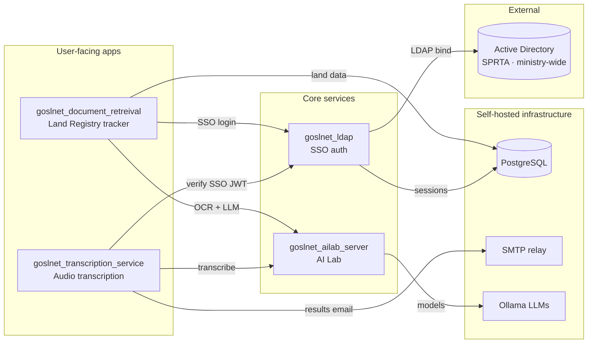
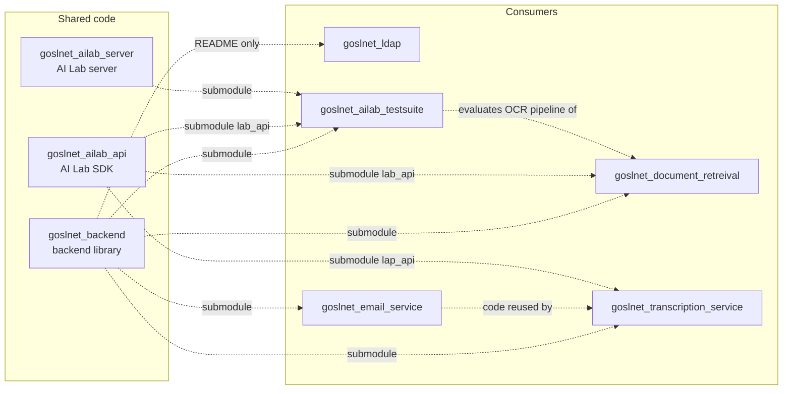

# PhysDev GOSLNet

## Projects

| Repo | Technologies | Role |
|---|---|---|
| `goslnet_backend` | Python, PostgreSQL (async psycopg), Pydantic, JWT, LDAP | Shared standard library: PostgreSQL models/tables, secrets, JWT, session auth, LDAP manager. Vendored into most other repos. |
| `goslnet_ldap` | Quart, Pydantic, JWT, PostgreSQL, Active Directory, nginx, Docker | SSO login microservice (`lrauthservice.goslnet.gov.lc`). One AD login → shared access/refresh JWT cookies reused by every downstream app. |
| `goslnet_ailab_server` | Quart, Ollama, Whisper, WebSockets, Pydantic, Docker | The "AI Lab": session-managed LLM server for Whisper transcription, OCR, image recognition, and chat (Ollama models). |
| `goslnet_ailab_api` | httpx, Pydantic, Ollama | Client SDK for the AI Lab; vendored as `lab_api` into the apps that consume it. |
| `goslnet_document_retreival` | Quart, httpx, PostgreSQL, Ollama (via lab_api), nginx, Docker | Land Registry document tracker: intake, assignment, review, notary circulation, search, admin. Includes a background scan verifications and recycling service run as separate processes. |
| `goslnet_transcription_service` | Quart, Pydantic, JWT, SMTP, Whisper (via AI Lab), nginx, Docker | Audio drop-off web app: SSO login → queued Whisper transcription via the AI Lab → transcripts/subtitles emailed to the user's AD email. |
| `goslnet_email_service` | Python, smtplib (SMTP), Pydantic, LDAP (via backend) | SMTP email helper built on the backend library's LDAP manager. Not an app of its own; its code is reused by the transcription service. |
| `goslnet_ailab_testsuite` | Pydantic, Ollama, mypy, black | Test suite measuring LLM-OCR accuracy on land-register scans (95% overall field accuracy). |
| `goslnet_style_guide` | Markdown | Org-wide coding standards. |

### Runtime topology

Solid arrows are runtime calls (HTTP / SSO / DB).

### Shared code reuse

Dashed arrows are code reused from other repos; "submodule" means the repo is included (vendored) as a git submodule pinned to a specific commit.

