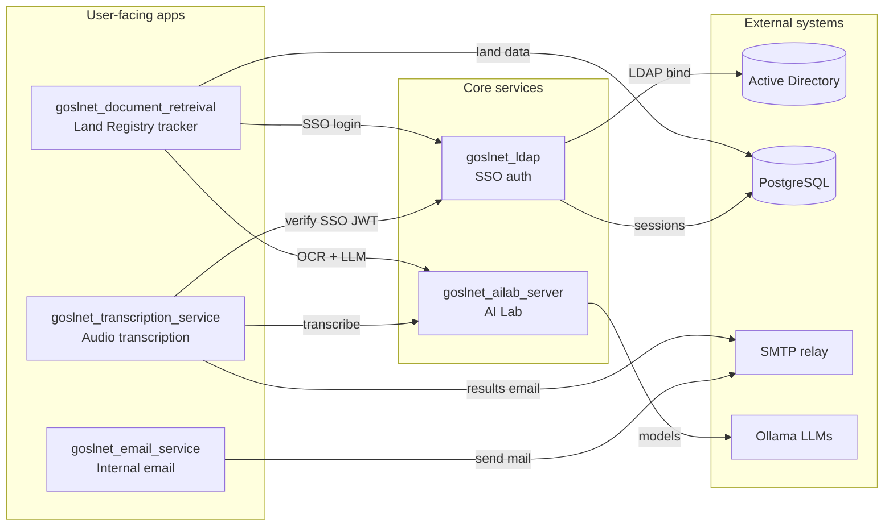
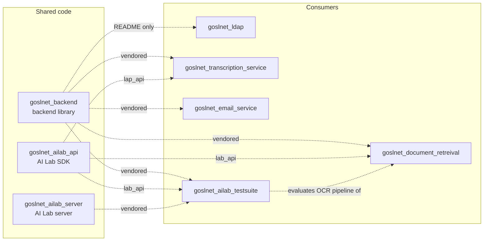

# PhysDev GOSLNet

## Projects

| Repo | Technologies | Role |
|---|---|---|
| `goslnet_backend` | Python, PostgreSQL (async psycopg), Pydantic, JWT, LDAP | Shared standard library: PostgreSQL models/tables, secrets, JWT, session auth, LDAP manager. Vendored into most other repos. |
| `goslnet_ldap` | Quart, Pydantic, JWT, PostgreSQL, Active Directory, nginx, Docker | SSO login microservice (`lrauthservice.goslnet.gov.lc`). One AD login → shared access/refresh JWT cookies reused by every downstream app. |
| `goslnet_ailab_server` | Quart, Ollama, Whisper, WebSockets, Pydantic, Docker | The "AI Lab": session-managed LLM server for Whisper transcription, OCR, image recognition, and chat (Ollama models). |
| `goslnet_ailab_api` | httpx, Pydantic, Ollama | Client SDK for the AI Lab; vendored as `lab_api`/`lap_api` into the apps that consume it. |
| `goslnet_document_retreival` | Quart, httpx, PostgreSQL, Ollama (via lab_api), nginx, Docker | Land Registry document tracker: intake, assignment, review, notary circulation, search, admin. Includes a background scan service (network folder → OCR/LLM → `LandRegisters` table). Three processes: app, scan, verification. |
| `goslnet_transcription_service` | Quart, Pydantic, JWT, SMTP, Whisper (via AI Lab), nginx, Docker | Audio drop-off web app: SSO login → queued Whisper transcription via the AI Lab → transcripts/subtitles emailed to the user's AD email. |
| `goslnet_email_service` | Python, smtplib (SMTP), Pydantic, LDAP (via backend) | Internal SMTP email helper built on the backend library's LDAP manager. |
| `goslnet_ailab_testsuite` | Pydantic, Ollama, mypy, black | Test suite measuring LLM-OCR accuracy on land-register scans (95% overall field accuracy). |
| `goslnet_style_guide` | Markdown | Org-wide coding standards. |

### Runtime topology

Solid arrows are runtime calls (HTTP / SSO / DB).

### Shared code (vendoring)

Dashed arrows are code included as git submodules.

## Branch reference

Per-repo documentation should always reference the **most recently updated branch**.

| Repo | Branch used | Most recent commit |
|---|---|---|
| `goslnet_document_retreival` | **`scn-document-ocr-pipeine`** | 2026-09-02 (vs `main` at 2026-07-22) |
| `goslnet_backend` | **`ldap`** | 2026-08-26 (vs `goslnet_document_retreival` 2026-08-21 and `main` 2026-07-10) |
| all other repos | `main` | only branch |

Notes:

- `goslnet_backend` keeps one branch per consumer (`ldap`, `goslnet_document_retreival`, …). The `ldap` branch is currently the freshest and its latest commit decouples document-tracker-specific logic from the shared library.
- On `scn-document-ocr-pipeine` (2026-09-02), the document tracker dropped its local login and now delegates auth to `goslnet_ldap`, verifying the shared SSO cookie with the auth service's public key. SSO is the org-wide auth pattern going forward. The branch name has a typo (`pipeine`) as it exists on GitHub.
- `goslnet_ldap`'s README documents `goslnet_backend` vendored under `src/`, but no `.gitmodules`/vendored copy exists on its current `main` tree.
